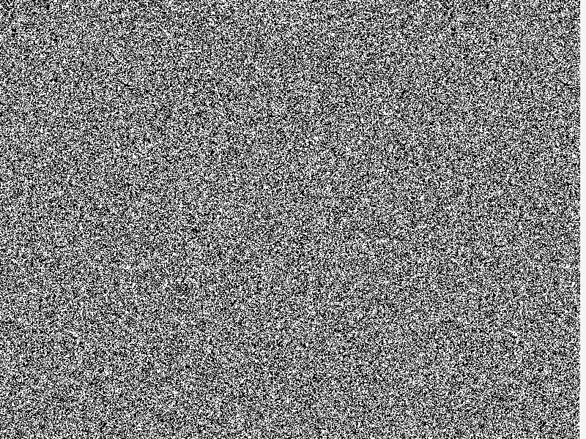

# Noise Generator with Raylib

This is a simple Go program using the Raylib library to create a noise generator. The program generates a window with a grid of pixels, where each pixel has a random chance of being black or white.



## Getting Started

### Prerequisites
- Make sure you have Go installed on your machine. If not, you can download it from [https://golang.org/dl/](https://golang.org/dl/).
- Install the Raylib library for Go using the following command:

  ```bash
  go get -u github.com/gen2brain/raylib-go/raylib
  ```

### Installation
1. Clone the repository:

    ```bash
    git clone https://github.com/usysrc/noise
    ```

2. Navigate to the project directory:

    ```bash
    cd noise 
    ```

3. Run the program:

    ```bash
    go run main.go
    ```

## Usage

- The program will open a window displaying a grid of pixels, with each pixel having a random chance of being black or white.
- The grid is continuously updated, creating a dynamic noise pattern.

## Customization

You can customize the program by modifying the parameters in the code. For example, you can change the window size, adjust the probability of a pixel being black or white, or modify the drawing logic.

## Acknowledgments

This program utilizes the Raylib library for Go, which can be found at [https://github.com/gen2brain/raylib-go](https://github.com/gen2brain/raylib-go).

## License

This project is licensed under the MIT License - see the [LICENSE](LICENSE) file for details. 
